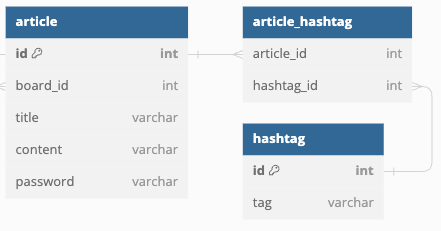

# 해시태그 기능

해시태그는 `#`으로 시작하는 메타데이터 태그이다. 어떤 게시글이,
제목 또는 본문의 문구와 전혀 연관이 없더라도, 전반적인 내용 측면에서 연관이 있을때
같은 해시태그를 가지고 있다면 해시태그를 기준으로 조회할 수 있게 해준다.

하나의 게시글은 여러 해시태그를 가질 수 있으며, 하나의 해시태그도 여러 게시글에
포함될 수 있다. 즉 M:N 관계이다.



## (`@ManyToOne` + `@OneToMany`) * 2

우선 `HashTag` Entity를 만들고,

```java
@Getter
@Entity
@NoArgsConstructor
public class HashTag {
    @Id
    @GeneratedValue(strategy = GenerationType.IDENTITY)
    private Long id;

    @Setter
    private String tag;
}
```

강의 시간에 다루지 않은건 최대한 배제하여, `@ManyToMany`를 사용하지 않고
`@ManyToOne`을 두개 가진 Join Table Entity를 직접 만들어 사용했다.

```java
@Getter
@Entity
@NoArgsConstructor
public class ArticleHashtag {
    @Id
    @GeneratedValue(strategy = GenerationType.IDENTITY)
    private Long id;

    @ManyToOne
    private Article article;

    @ManyToOne
    private HashTag hashTag;
}
```

그리고 각각의 Entity에는 `@OneToMany` 속성을 추가해 주었다.

```java
@Getter
@Entity
@NoArgsConstructor
public class Article {
    // ...
    
    @OneToMany(mappedBy = "article")
    private final List<ArticleHashtag> hashtags = new ArrayList<>();
    
    // ...
}

@Getter
@Entity
@NoArgsConstructor
public class HashTag {
    //...
    
    @OneToMany(mappedBy = "hashTag")
    private List<ArticleHashtag> articleHashtag;
    
    // ...
}
```

## HashTag 만들기

요구사항으로는 게시글의 내용 중 `#`으로 시작하는 단어를 의미한다. 이를 찾기 위해,

1. 입력된 `String content`를 공백문자 기준으로 `split()`한다.
   `String[] words = content.split(" ");`
2. 이렇게 분리한 단어들을 살펴보며, `#`으로 시작하는 단어만 판단한다.
   ```java
   for (String word: words) {
       if (word.startsWith("#")) {}
   }
   ```
3. 해당 태그가 이미 존재하는지 판단한다. 이를 위해 Query Method를 추가한다. 이때,
   - 이미 존재하는 `HashTag`라면 그냥 추가하고,
   - 존재하지 않는 `HashTag`라면 데이터를 저장 후 추가해준다.
   
    ```java
    Optional<HashTag> hashTagOptional = hashTagRepository.findByTag(word);
    if (hashTagOptional.isPresent()) hashTags.add(hashTagOptional.get());
    else hashTags.add(hashTagRepository.save(new HashTag(word)));
    ```

이렇게 태그를 모아서 `Set`로 반환하는 하나의 메서드로 만들었다.

```java
private Set<HashTag> createHashTags(String content) {
    String[] words = content.split(" ");
    Set<HashTag> hashTags = new HashSet<>();
    for (String word: words) {
        if (word.startsWith("#")) {
            Optional<HashTag> hashTagOptional = hashTagRepository.findByTag(word);
            if (hashTagOptional.isPresent()) hashTags.add(hashTagOptional.get());
            else hashTags.add(hashTagRepository.save(new HashTag(word)));
        }
    }

    return hashTags;
}
```

그리고 게시글을 작성하는 메서드에 이를 이용해 게시글과 해시태그의 관계를 관리하는
`ArticleHashtag`를 만드는데 사용한다.

```java
public ArticleDto create(Long boardId, ArticleDto dto) {
    // ...
    article = articleRepository.save(article);
    for (HashTag hashTag: createHashTags(article.getContent())) {
        articleHashtagRepository.save(new ArticleHashtag(article, hashTag));
    }
    return ArticleDto.fromEntity(articleRepository.save(article));
}
```

### `ArticleDto`에 `tags` 추가

게시글을 조회할 때 어떤 해시태그가 있는지가 나와야 하기 때문에 `ArticleDto`에 추가해줄 필요가 있다.
해시태그는 문자열로 구분하기 때문에, 추가적인 DTO 구현 대신 문자열 리스트로만 담는다.

```java
@Getter
@ToString
@NoArgsConstructor
public class ArticleDto {
    // ...
    private final List<String> tags = new ArrayList<>();
    // ...
}
```

`fromEntity` 메서드에서도 `@OneToMany`로 연결된 `hashTags` 속성의 각 요소에,
개별적으로 연결된 `HashTag` Entity의 값을 활용해 리스트를 채운다.

```java
public static ArticleDto fromEntity(Article entity) {
    // ...
    for (ArticleHashtag articleHashtag: entity.getHashtags()) {
        dto.tags.add(articleHashtag.getHashTag().getTag());
    }
    // ...
}
```

## 태그별 조회

먼저 `HashTag` Entity를 태그를 기준으로 조회하면, 거기에 연결된 `ArticleHashtag` Entity는
`@OneToMany`로 조회할 수 있다. 그리고 `ArticleHashtag`의 `Article`은 실제 게시글이
연결되어 있다.

```java
public List<ArticleDto> byTag(String tag) {
    HashTag hashTag = hashTagRepository.findByTag(tag)
            .orElseThrow();

    List<ArticleDto> articles = new ArrayList<>();
    for (ArticleHashtag joinEntity: hashTag.getArticleHashtag()) {
        articles.add(ArticleDto.fromEntity(joinEntity.getArticle()));
    }

    return articles;
}
```

이 목록을 보여주기 위한 템플릿을 반환하도록만 하면 된다.

```java
@Slf4j
@Controller
@RequiredArgsConstructor
public class ArticleController {
    private final BoardService boardService;
    private final ArticleService articleService;

    // ...
    @GetMapping("hashtag")
    public String byTag(
            @RequestParam("tag")
            String tag,
            Model model
    ) {
        model.addAttribute("tag", tag);
        model.addAttribute("articles", articleService.byTag(tag));
        return "tag";
    }
    // ...
}
```
